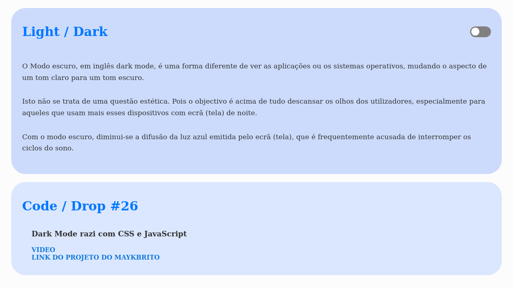
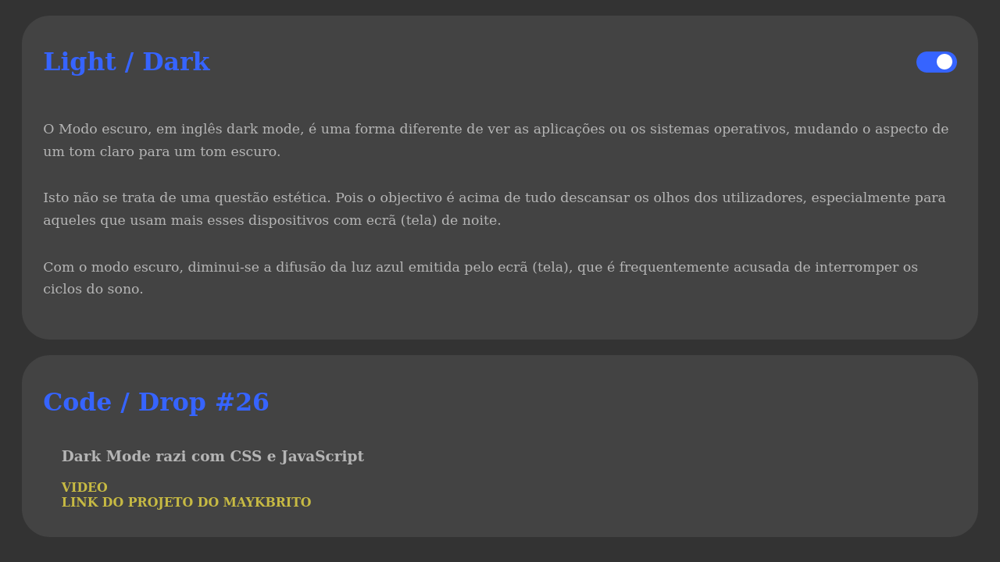

# Dark Mode

Nesse projeto uso o conceito de Dark Mode (modo escuro), com uso das tecnologias: HTML, CSS e Javascript

## Fotos do projeto

### Esse Projeto é baseado no Code / Drop - 26 da Rockteseat

<footer>  
  <a href="https://www.youtube.com/watch?v=BvhYm0BOLvA" target="_blank" rel="noopener noreferrer">Video</a>
  
  <a href="https://gist.github.com/maykbrito/f3744039fcc20db62d6cfd502aa2bc86" target="_blank" rel="noopener noreferrer">Projeto do Mayk Brito</a>
</footer>